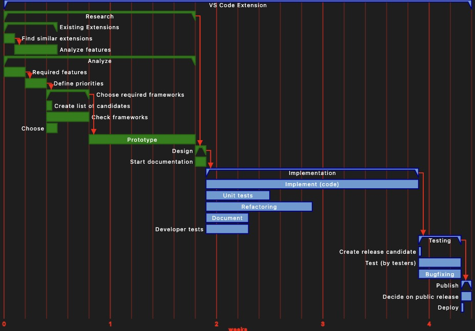
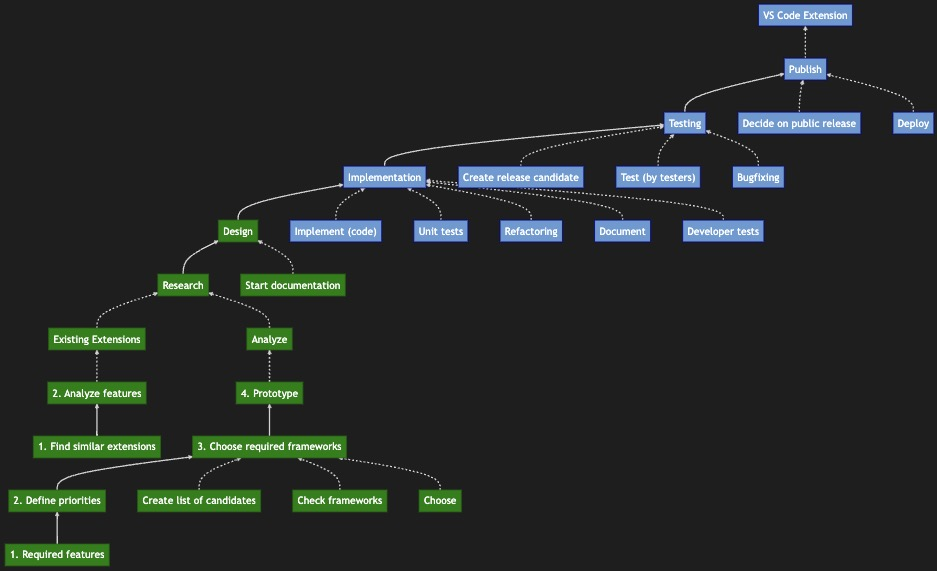
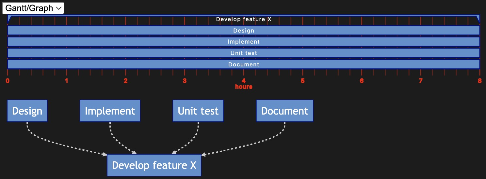
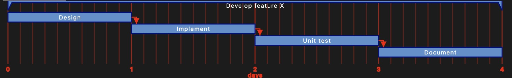
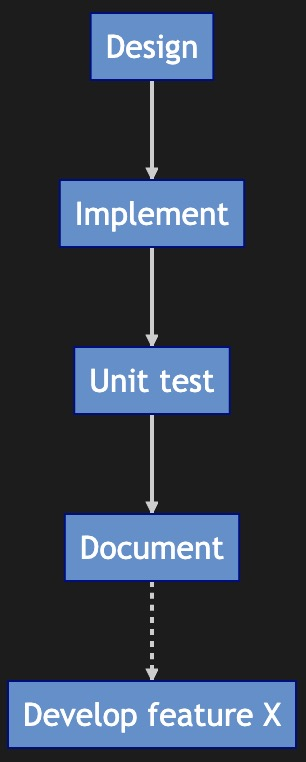
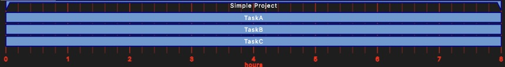
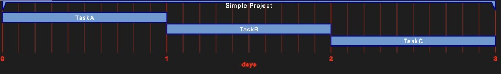
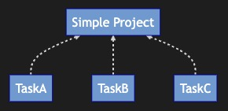

# Markdown Planner

"Markdown Planner" is a simple tool that allows you to create graphs and Gantt charts from markdown files. Its syntax is easy to use, and in many cases, you can simply write your tasks in a markdown file without any additional steps. Alternatively, you can use existing markdown files and view them as graphs or Gantt charts.

The main purpose of "Markdown Planner" is to quickly visualize task dependencies. It also provides rough duration estimates based on the Gantt chart.

# Visualization

"Markdown Planner" offers two different ways to visualize a markdown file: as a Gantt chart or as a directed graph.

Below is a simple plan for the fictional software development of a "VS Code Extension".

## Gantt



## Graph




# What it is not

"Markdown Planner" is primarily a planning tool and not a tracking tool. As a result, you won't find specific dates in the Gantt chart. However, it can be useful to visualize when a task has been completed to some extent. This is the limited tracking support available in "Markdown Planner".

Additionally, "Markdown Planner" does not support resource planning. You cannot assign multiple people to a task to reduce its duration. Therefore, the duration and effort is essentially the same in "Markdown Planner".


# Example

To demonstrate the usage of "Markdown Planner," create a markdown file named 'plan.md' and add the following text:
~~~md
# Develop feature X
- Design
- Implement
- Unit test
- Document
~~~

Then, in the VS Code file explorer, right-click on the file and select "Open with 'Markdown Planner'." The file will be visualized as a Gantt chart and a graph, as shown in the following image:


(You can choose to display both charts or only one by selecting the desired option from the dropdown menu labeled 'Gantt/Graph'.)

In general, every heading (#) and list item (- or 1., etc.) will be visualized in the charts. The text below a heading or list item (which is not included in this example), typically contains more detailed information on the tasks.
This info will not be shown in the charts.

The tasks in the example so far have no dependencies. You can add dependencies in two ways.

One way is to use an ordered list:
~~~md
# Develop feature X
1. Design
2. Implement
3. Unit test
4. Document
~~~

This automatically adds dependencies between the items in the ordered list. The result is shown below:

(Please note the red dependency lines in the Gantt chart.)

Similarly:



The other way is to explicitly add dependencies using the {...} syntax. Simply add {...} to the end of the task text and specify the task it depends on. For example, to achieve the same result as above with an unordered list, you can use:
~~~md
# Develop feature X
- Design
- Implement {Design}
- Unit test {Implement}
- Document {Unit}
~~~

You can have as many hierarchy levels as you like. Here's an example:
~~~md
# TA
## TB
### TC
- td
  - te
    - tf
~~~


# Special Syntax {...}

"Markdown Planner" supports a few directives that can be set at the end of a task title to define properties for the task. To use this syntax, surround it with curly brackets and separate each property with a comma (,). The order of properties is not important. For example: ```{Implementation,x,5d}``` represents the following properties for a task:

- The task's predecessor is "Implementation."
- The task is completed ```{Implementation,x,5d}```, which will be displayed in green in the Gantt chart or graph.
- The task's effort or duration is 5 days.

In more detail:
- Duration/Effort: You can specify it in hours (h), days (d), weeks (w), months (m), or years (y). The equivalent relationships are as follows:
    - 8h = 1d
    - 1w = 5d
    - 1m = 21d
    - 1y = 260d
  I.e. this is on average without holidays or vacation.
  It is also possible to enter time as a fractional number.
  Valid inputs are e.g.: ```2d 0.5d 5h 0.25m 3w 0.5y```
- ```x```: You can mark a task as completed by adding x to it. This will make it appear green in the Gantt chart or graph.
  Note: This also supports the extended syntax for markdown task lists. If a task starts with "- [ ]" or "- [x]," the extended syntax is used.
- ```-```: Adding this will collapse all child tasks.
- Any text: It is interpreted as a predecessor to the task. You don't have to enter the full name; entering the starting part of the name is sufficient if it's unambiguous.


# Interactive Charts

Both the Gantt chart and the directed graph offer a few interactive features.
You can right-click on the charts to access the context menu.
Additionally, you can zoom the charts using the mouse wheel and pan by holding down the left mouse button.


## Gantt

### X Axis

You can change the time scale of the X-axis to automatic, years, months, weeks, days, or hours.

### Parallel Tasks

You can choose whether the Gantt chart allows all independent tasks to occur simultaneously or if they must be completed one after the other. This simulates the scenario of multiple people working in parallel or only a single person being available.

Comparing both charts will give you a sense of the minimum and maximum durations to expect for the project.

For example, consider the following simple project:
~~~md
# Simple Project
- TaskA
- TaskB
- TaskC
~~~

With 'Parallel Tasks' selected (allowing several people to work in parallel), the Gantt chart would look like this:


Without (one person working sequentially), the chart would be as follows:



## Graph

ou can change the direction of the graph. By default, it is drawn from top to bottom, but you can choose to draw it from left to right or even from bottom to top.
For example "Bottom-Top":


